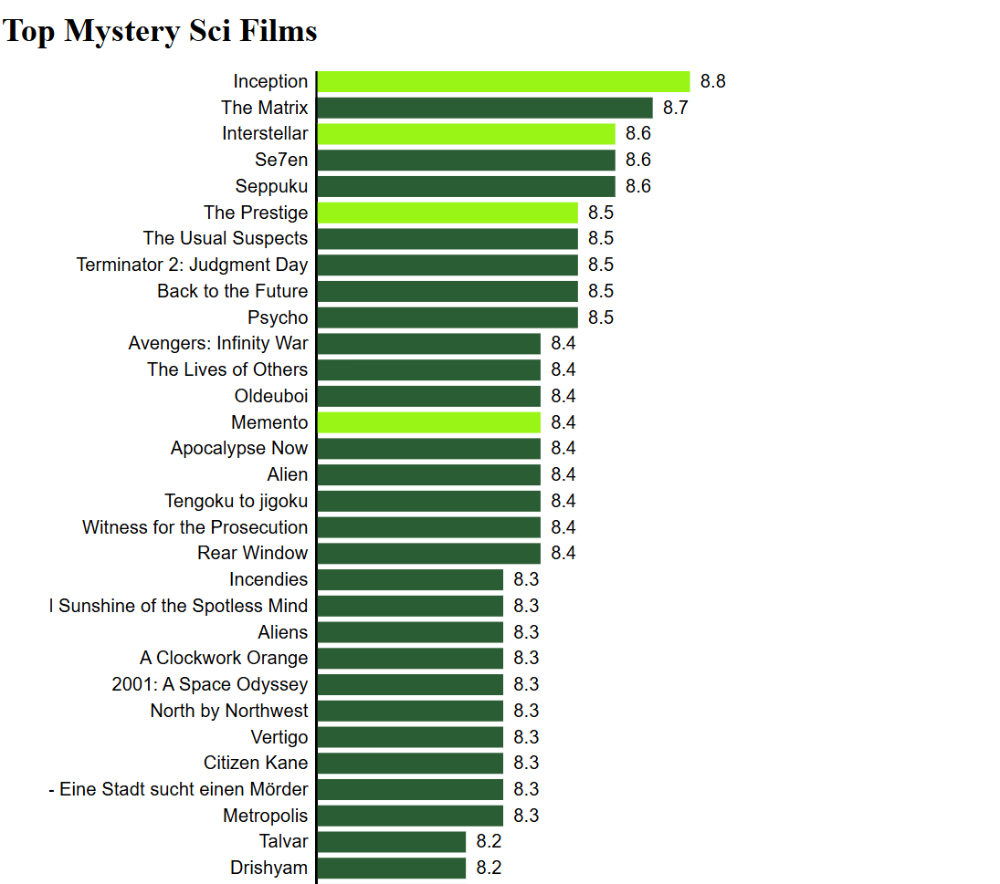

Bar chart lesson main concept covers the loading in of data, ternary operators(conditional fill of bars), template literals(to allow string/variable arguments to be passed). Scales defining the domain and the range of the data to be plotted. The grouped element to allow the multplie elements to be appended to a group which can then all move in one go rather than separatley.

End product:

